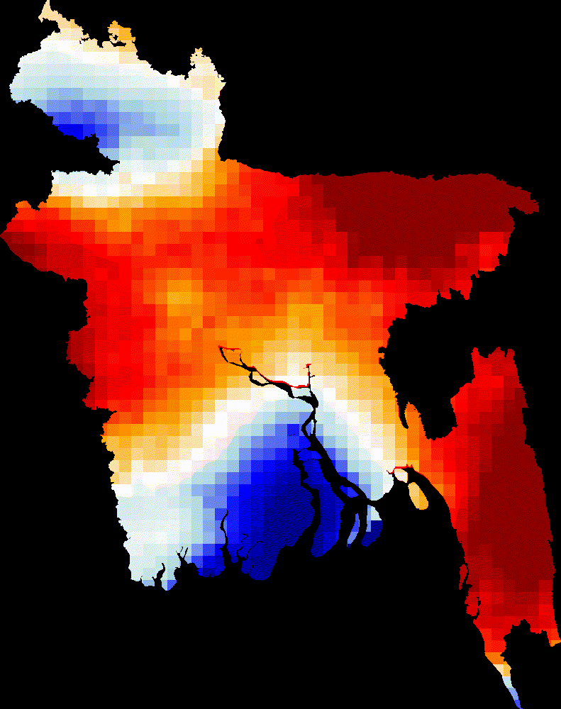

# Google-Earth-Engine
Geospatial Analysis with Python and Google Earth Engine API.

    

# Bangladesh Annual Precipitation Change Detection duirng 2000 to 2025 Using Animation

  

<h4 align="center">Animated Precipitation Change (2000 - 2025) </h4>

  
## Overview
This project analyzes long-term precipitation variability across Bangladesh using GPM (Global Precipitation Measurement) Version 7 dataset ( <a href="https://developers.google.com/earth-engine/datasets/catalog/NASA_GPM_L3_IMERG_MONTHLY_V07#bands">GPM: Monthly Global Precipitation Measurement (GPM) vRelease 07</a> ) satellite precipitation data from 2000–2025. The dataset was processed in Google Earth Engine (GEE) to evaluate spatial patterns of precipitation change and identify regions experiencing increasing or decreasing precipitation trends.

## Study Area

Bangladesh is located in South Asia between approximately:

- **Latitude:** 20°34′N – 26°38′N
- **Longitude:** 88°01′E – 92°41′E

The country experiences a **tropical monsoon climate** characterized by four distinct seasons:

- **Pre-monsoon season**
- **Southwest monsoon season**
- **Post-monsoon season**
- **Winter dry season**

Annual precipitation varies considerably across the country, ranging from relatively dry conditions in the northwestern regions to some of the highest rainfall totals in the northeastern and southeastern regions. These spatial differences are primarily influenced by monsoonal circulation, topography, and regional climatic conditions.
## Dataset

**Global Precipitation Measurement (GPM) IMERG Monthly Version 07**

* Data Provider: NASA
* Product: GPM IMERG Monthly V07
* Variable: Precipitation
* Temporal Resolution: Monthly
* Analysis Period: 2000–2025
* Platform: Google Earth Engine API and Colab Jupyter Notebook

## Methodology

1. Monthly GPM precipitation data were collected for Bangladesh.
2. Monthly precipitation values were aggregated into annual totals.
3. Annual precipitation differences were calculated between consecutive years.
4. Spatial precipitation change maps were generated for each year.
5. Results were visualized as an animated GIF to illustrate temporal rainfall variability.

## Visualization

The animation displays year-to-year precipitation changes across Bangladesh from 2000–2025.

### Color Interpretation

| Color      | Interpretation                     |
| ---------- | ---------------------------------- |
| Dark Red   | Strong decrease in precipitation   |
| Red        | Moderate decrease in precipitation |
| Orange     | Slight decrease in precipitation   |
| White      | Little or no change                |
| Light Blue | Slight increase in precipitation   |
| Blue       | Moderate increase in precipitation |
| Dark Blue  | Strong increase in precipitation   |

## Applications

* Climate Change Assessment
* Hydrological Studies
* Water Resource Management
* Agricultural Planning
* Flood and Drought Monitoring
* Environmental Research

## Software and Tools

* Google Earth Engine
* Python
* Geemap
* Xarray
* GeoPandas
* NumPy
* Matplotlib

